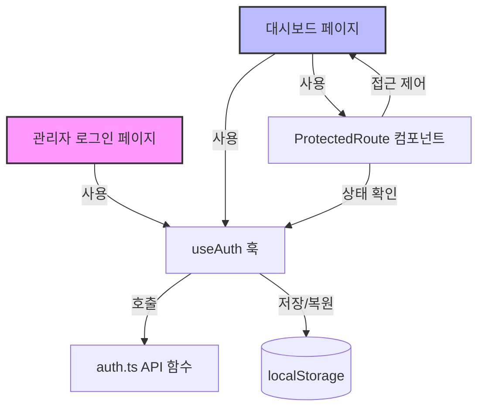
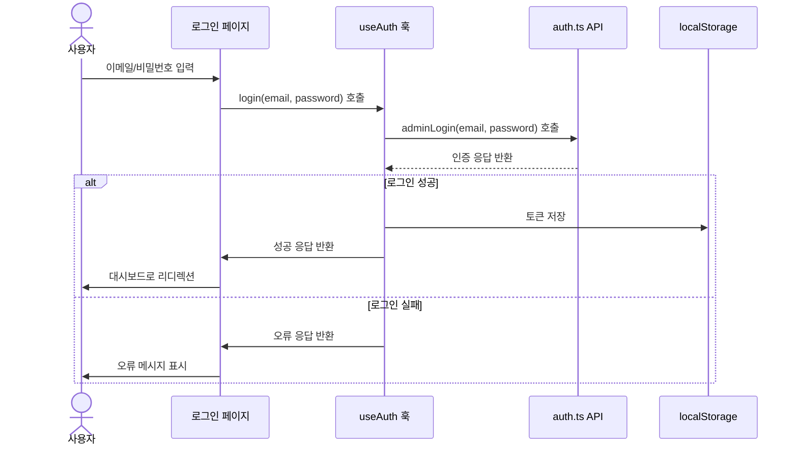
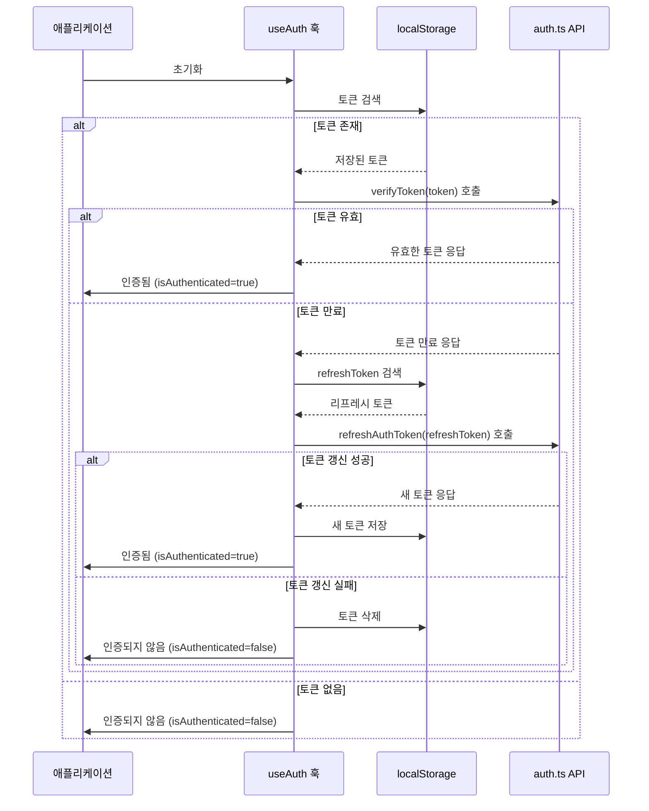
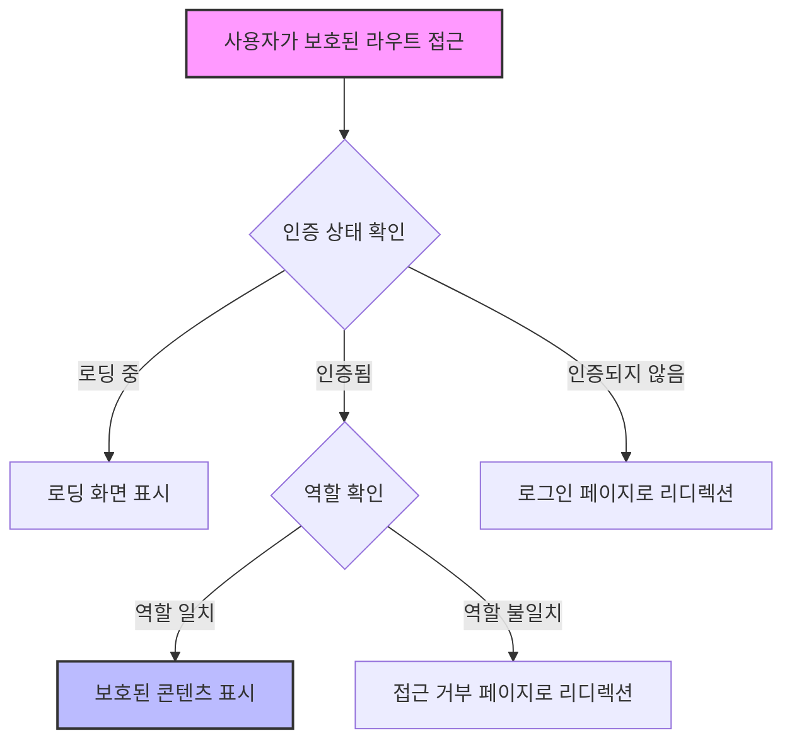
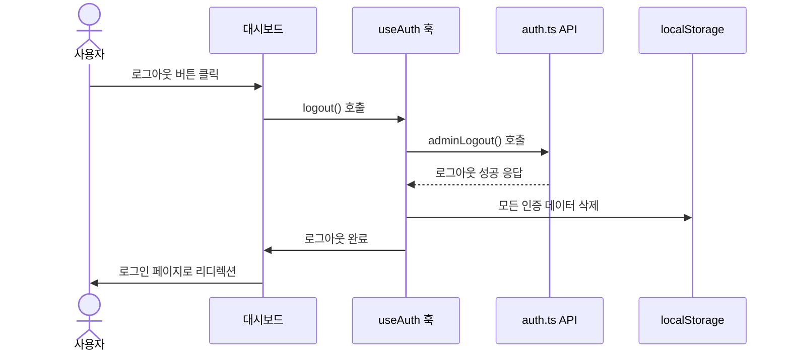
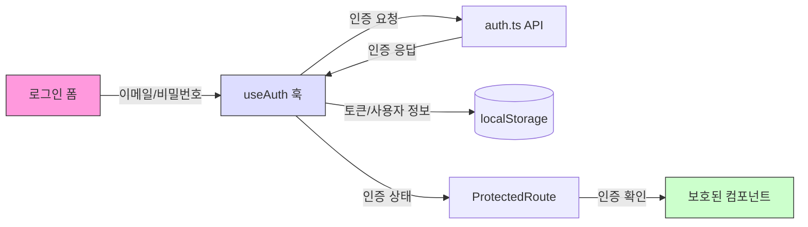

# 관리자 인증 시스템 다이어그램

## 컴포넌트 관계도

## 로그인 시퀀스 다이어그램

## 인증 상태 확인 시퀀스 다이어그램

## 보호된 라우트 접근 흐름도

## 로그아웃 시퀀스 다이어그램

## 데이터 흐름 다이어그램

이러한 다이어그램은 시스템의 동작을 시각적으로 표현하여 개발자와 비기술적 이해관계자 모두가 인증 흐름을 쉽게 이해할 수 있도록 도와줍니다.
